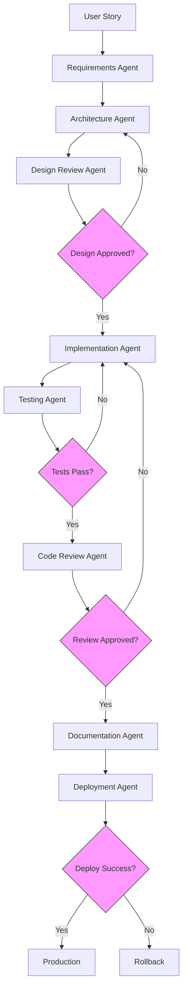
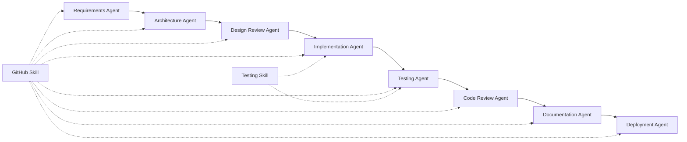

# AI-Powered SDLC Agents Configuration

This repository contains a complete AI-powered Software Development Lifecycle (SDLC) system with 8 specialized agents and 1 orchestrator agent working together to automate the entire development process from requirements to deployment.

---

## Agent Registry

### 1. Requirements Agent
**File:** `.github/agents/requirements.agent.md`  
**Description:** Analyzes user stories, creates functional and non-functional requirements  
**Phase:** Planning  
**Invocation:** `@requirements` or "Requirements Agent"  
**Output:** `docs/requirements.md`

**Responsibilities:**
- Read and analyze user stories
- Create FR (Functional Requirements)
- Create NFR (Non-Functional Requirements)
- Ask clarifying questions
- Update requirements documentation
- Maintain requirements traceability

---

### 2. Architecture Agent
**File:** `.github/agents/architecture.agent.md`  
**Description:** Designs system architecture and component structure  
**Phase:** Planning  
**Invocation:** `@architecture` or "Architecture Agent"  
**Output:** `docs/architecture.md`

**Responsibilities:**
- Design system components
- Choose technology stack
- Create component diagrams
- Create data flow diagrams
- Document design decisions
- Define system boundaries

---

### 3. Design Review Agent
**File:** `.github/agents/design-reviewer.agent.md`  
**Description:** Reviews architecture quality against requirements  
**Phase:** Planning  
**Invocation:** `@design-review` or "Design Review Agent"  
**Output:** `docs/design-review.md`

**Responsibilities:**
- Validate requirements coverage
- Review architecture quality
- Identify security risks
- Check scalability concerns
- Ensure testability
- Approve or reject design

**Quality Gate:** Design must be APPROVED to proceed

---

### 4. Implementation Agent
**File:** `.github/agents/implementation.agent.md`  
**Description:** Writes production-ready code based on architecture  
**Phase:** Development  
**Invocation:** `@implementation` or "Implementation Agent"  
**Output:** Source code files, `docs/implementation-notes.md`

**Responsibilities:**
- Implement all components
- Follow architecture design
- Write clean, maintainable code
- Implement all FR requirements
- Handle edge cases
- Document implementation

---

### 5. Testing Agent
**File:** `.github/agents/testing.agent.md`  
**Description:** Creates comprehensive test suites and executes tests  
**Phase:** Development  
**Invocation:** `@testing` or "Testing Agent"  
**Output:** Test files, `docs/test-report.md`, `docs/test-traceability.md`

**Responsibilities:**
- Create unit tests
- Create integration tests
- Create E2E tests
- Execute test suites
- Validate requirements coverage
- Generate test reports

**Quality Gate:** All tests must PASS (100%)

---

### 6. Code Review Agent
**File:** `.github/agents/code-review.agent.md`  
**Description:** Reviews code quality, security, and best practices  
**Phase:** Quality Assurance  
**Invocation:** `@code-review` or "Code Review Agent"  
**Output:** `docs/code-review-report.md`

**Responsibilities:**
- Review code quality
- Identify security vulnerabilities
- Check performance issues
- Validate accessibility
- Ensure architecture compliance
- Approve or reject code

**Quality Gate:** Code review must be APPROVED to proceed

---

### 7. Documentation Agent
**File:** `.github/agents/documentation.agent.md`  
**Description:** Creates comprehensive technical and user documentation  
**Phase:** Quality Assurance  
**Invocation:** `@documentation` or "Documentation Agent"  
**Output:** `README.md`, user guides, API docs, `CHANGELOG.md`

**Responsibilities:**
- Create user documentation
- Create developer documentation
- Generate API documentation
- Update README
- Create deployment guides
- Maintain CHANGELOG

---

### 8. Deployment Agent
**File:** `.github/agents/deployment.agent.md`  
**Description:** Handles versioning, releases, and production deployment  
**Phase:** Release  
**Invocation:** `@deployment` or "Deployment Agent"  
**Output:** Git tags, release notes, deployed application

**Responsibilities:**
- Manage semantic versioning
- Prepare releases
- Create git tags
- Generate release notes
- Execute deployment
- Verify deployment success

**Quality Gate:** Pre-deployment checks must PASS

---

### 9. SDLC Orchestrator (Master Agent)
**File:** `.github/agents/orchestrator.agent.md`  
**Description:** Orchestrates all 8 agents through complete SDLC pipeline  
**Phase:** All  
**Invocation:** `@orchestrator` or "SDLC Orchestrator"  
**Output:** Pipeline execution report, all artifacts from all agents

**Responsibilities:**
- Coordinate all agents
- Enforce sequential workflow
- Manage quality gates
- Handle errors and retries
- Track progress
- Generate pipeline reports

**Usage:**
```
Run complete SDLC pipeline for: [user story]
Run SDLC pipeline starting from [agent name]
```

---

## SDLC Pipeline Flow



---

## Quality Gates

### Gate 1: Design Review
- **Location:** After Architecture Agent
- **Criteria:** Design must be APPROVED (not REJECTED or CHANGES REQUIRED)
- **Action if Failed:** Loop back to Architecture Agent

### Gate 2: Testing
- **Location:** After Testing Agent
- **Criteria:** All tests must PASS (100%)
- **Action if Failed:** Loop back to Implementation Agent

### Gate 3: Code Review
- **Location:** After Code Review Agent
- **Criteria:** Code review must be APPROVED
- **Action if Failed:** Loop back to Implementation Agent

### Gate 4: Pre-Deployment
- **Location:** Before Deployment
- **Criteria:** All checks pass (tests, review, documentation)
- **Action if Failed:** Block deployment, fix issues

---

## Skills Registry

### GitHub Integration Skill
**File:** `.github/skills/github-integration.skill.md`  
**Capabilities:**
- Branch management
- Commit management with conventional commits
- Pull request creation and management
- Issue tracking
- Git tagging and releases
- Repository status checking

**Used By:** All agents for version control

### Testing Automation Skill
**File:** `.github/skills/testing-automation.skill.md`  
**Capabilities:**
- Unit testing (Jest)
- E2E testing (Cypress)
- Accessibility testing (cypress-axe)
- Performance testing (Lighthouse)
- Test coverage reporting
- Custom test commands

**Used By:** Testing Agent, Implementation Agent

---

## Agent Invocation Examples

### Invoke Single Agent

```bash
# Requirements Agent
"Create requirements from user story: Display login error message"

# Architecture Agent
"Design architecture for login feature based on requirements"

# Implementation Agent
"Implement login validation according to architecture"

# Testing Agent
"Create tests for login feature"

# Code Review Agent
"Review the login implementation code"

# Documentation Agent
"Generate documentation for login feature"

# Deployment Agent
"Deploy version 1.0.0 to production"
```

### Invoke Orchestrator (Full Pipeline)

```bash
# Complete pipeline from scratch
"Run complete SDLC pipeline for: Display 'Login failed' on invalid credentials"

# Resume from specific agent
"Run SDLC pipeline starting from Implementation Agent"

# Resume from specific phase
"Run SDLC pipeline starting from Testing phase"
```

---

## Agent Dependencies



---

## Artifacts Matrix

| Agent | Input Artifacts | Output Artifacts |
|-------|----------------|------------------|
| Requirements | User story | `docs/requirements.md` |
| Architecture | `docs/requirements.md` | `docs/architecture.md` |
| Design Review | `docs/requirements.md`, `docs/architecture.md` | `docs/design-review.md` |
| Implementation | `docs/requirements.md`, `docs/architecture.md` | Source code, `docs/implementation-notes.md` |
| Testing | Source code, `docs/requirements.md` | Test files, `docs/test-report.md` |
| Code Review | Source code, tests, all docs | `docs/code-review-report.md` |
| Documentation | All artifacts | `README.md`, guides, API docs |
| Deployment | All artifacts | Git tags, release notes, deployed app |

---

## Git Workflow Integration

Each agent commits its artifacts using conventional commits:

```bash
# Requirements Agent
git commit -m "docs: Update requirements from user story US-123"

# Architecture Agent
git commit -m "docs: Add system architecture design"

# Design Review Agent
git commit -m "docs: Add design review report - APPROVED"

# Implementation Agent
git commit -m "feat: Implement login validation - FR-001 to FR-010"

# Testing Agent
git commit -m "test: Add unit and e2e tests for login feature"

# Code Review Agent
git commit -m "docs: Add code review report - APPROVED"

# Documentation Agent
git commit -m "docs: Add user guide and API documentation"

# Deployment Agent
git commit -m "chore: Release version 1.0.0"
```

---

## Pull Request Workflow

1. **Orchestrator** creates feature branch
2. **All agents** commit to feature branch
3. **Code Review Agent** creates PR with detailed description
4. **GitHub Actions** runs automated checks
5. **Human reviewer** (optional) reviews PR
6. **Deployment Agent** merges PR and deploys

---

## Continuous Integration

Integrate agents with CI/CD pipeline:

```yaml
# .github/workflows/sdlc.yml
name: AI-SDLC Pipeline

on:
  push:
    branches: [main, develop]
  pull_request:

jobs:
  sdlc:
    runs-on: ubuntu-latest
    
    steps:
      - uses: actions/checkout@v3
      
      - name: Run Testing Agent
        run: npm test
      
      - name: Run Code Review Agent
        run: npm run review
      
      - name: Deploy (if main branch)
        if: github.ref == 'refs/heads/main'
        run: npm run deploy
```

---

## Usage Guide

### For New Features

1. Write user story or feature description
2. Invoke Orchestrator: `"Run complete SDLC pipeline for: [feature description]"`
3. Orchestrator coordinates all agents
4. Review pipeline report
5. Feature deployed to production

### For Bug Fixes

1. Document the bug
2. Invoke from Implementation Agent: `"Run SDLC pipeline starting from Implementation Agent"`
3. Skips requirements and architecture
4. Implements fix, tests, reviews, documents, deploys

### For Documentation Updates

1. Invoke Documentation Agent directly: `"Update documentation for [feature]"`
2. No need for full pipeline

### For Architecture Review

1. Invoke Design Review Agent: `"Review architecture against requirements"`
2. Address any issues
3. Continue pipeline from Implementation

---

## Quality Metrics

Each agent contributes to quality metrics:

- **Requirements Coverage:** % of requirements implemented
- **Test Coverage:** % of code covered by tests
- **Code Quality:** Code review score
- **Documentation Coverage:** % of features documented
- **Deployment Success:** % of successful deployments

---

## Troubleshooting

### Pipeline Blocked at Quality Gate

**Symptom:** Agent reports REJECTED or CHANGES REQUIRED  
**Solution:** Address issues, re-run failed agent and subsequent agents

### Tests Failing

**Symptom:** Testing Agent reports failed tests  
**Solution:** Invoke Implementation Agent to fix bugs, then re-test

### Deployment Failed

**Symptom:** Deployment Agent reports deployment failure  
**Solution:** Check logs, rollback if needed, fix issues, re-deploy

---

## Contributing to Agents

To add a new agent:

1. Create agent file in `.github/agents/[name].agent.md`
2. Define responsibilities and outputs
3. Add to this AGENTS.md file
4. Update Orchestrator workflow
5. Test agent independently
6. Integrate into pipeline

---

## Version History

- **v1.0.0** - Initial SDLC agent system with 8 specialized agents + orchestrator
- All agents operational and tested
- GitHub integration complete
- Testing automation complete

---

## Support and Documentation

- **Agent Files:** `.github/agents/*.agent.md`
- **Skill Files:** `.github/skills/*.skill.md`
- **Documentation:** `docs/`
- **Examples:** See individual agent files

---

## License

Same as project license.

---

**Last Updated:** May 23, 2026  
**Maintained By:** SDLC Orchestrator Agent
